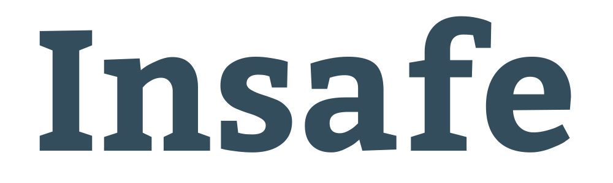

[](https://npmjs.org/package/insafe)
[](LICENSE)
[](https://travis-ci.org/w3c/insafe)
[](https://coveralls.io/r/w3c/insafe)
[](https://david-dm.org/w3c/insafe)
[](https://david-dm.org/w3c/insafe#info=devDependencies)



Insafe is a Node.js package which resolves and checks that an URL is well-formed.

## Features

- **URL resolution**: `w3.org` -> `http://w3.org`
- **DNS check**
- **HTTP/HTTPS check** (customizable)
- **Host blacklist**
- **Host whitelist**

## Installation

```
npm install insafe
```

## Usage

Insafe is a JavaScript Promise-based API.

It exposes a `check(options)` function that returns a Promise. This Promise will resolve to an object containing:

- **resolved url** `String`
- **status** (true if well formed, else false) `Boolean`
- **error report** `Array`

or rejects with the unexpected errors the checker encountered when checking the URL

Example:

```javascript
var insafe = require('insafe');

insafe.check({
	url: 'example.com'
}).then(function (res) {
  if(res.status == false) {
  console.log('not valid url: ' +res.url);
  } else {
  console.log('The URL is valid.');
  }
}).catch(console.log);
```

Several options are available to check the URL:

- **url** (required): a `String`.
- **statusCodesAccepted**: an `Array` of accepted HTTP(S) status codes. See the [default config](https://github.com/w3c/insafe/blob/master/lib/insafe.js).
- **statusCodesRefused**: an `Array` of refused HTTP(S) status codes. See the [default config](https://github.com/w3c/insafe/blob/master/lib/insafe.js).
- **blacklist**: an `Array` of blacklisted hosts.
- **whitelist**: an `Array` of whitelisted hosts.

Example:

```javascript
var insafe = require('insafe');

insafe.check({
    url: 'http://www.w3.org/',
    statusCodesAccepted: ["404"],
    statusCodesRefused: ["301", "203"],
    blacklist: ['h4ck3rz.org'],
    whitelist: ['www.w3.org', 'example.com']
}).then(function (res) {
  if(res.status == false) {
  console.log('not valid url: ' +res.url);
  } else {
  console.log('The URL is valid.');
  }
}).catch(console.log);
```
